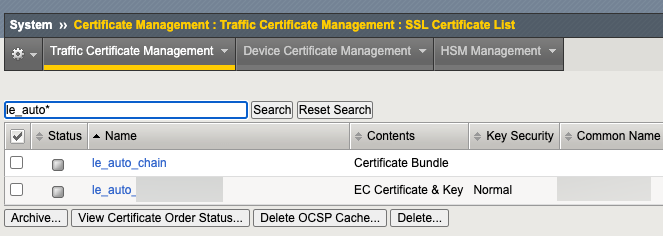
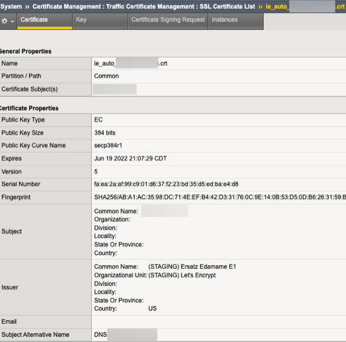

## Synopsis

This project is a rewrite of my original project ([archived](archive)) based on Lukas2511's letsencrypt.sh shell script 
as the basis for deploying certificates to an F5 BIG-IP. This update utilizes Lukas2511's 
[dehydrated](https://github.com/dehydrated-io/dehydrated)
acme client.

Secondly, this update uses the HTTP challenge instead of the DNS challenge I used in the original project.

Finally, it still utilizes F5's iControl REST interface to upload and configure the certificates, but I swap
out the mostly-retired [f5-sdk](https://github.com/f5networks/f5-common-python) library for the
[bigrest](https://github.com/leonardobdes/BIGREST) library.

Removed from this project altogether is the creation of client SSL profiles, as that is a separate function
than certificate management and should have its own workflow.

## Test Setup
```bash
/etc/dehydrated/config # Dehydrated configuration file
/etc/dehydrated/domains.txt # Domains to sign and generate certs for
/etc/dehydrated/dehydrated # acme client
/etc/dehydrated/challenge.irule # iRule configured and deployed to BIG-IP by the hook script
/etc/dehydrated/hook_script.py # Python script called by dehydrated for special steps in the cert generation process
# Environment Variables
export F5_HOST=x.x.x.x
export F5_USER=admin
export F5_PASS=admin
```
## Usage

### Testing - Stage API
./dehydrated -c --force --force-validation

### Otherwise
./dehydrated -c

## Expected Output

```bash
# ./dehydrated -c --force --force-validation
# INFO: Using main config file /etc/dehydrated/config
Processing example.com
 + Checking expire date of existing cert...
 + Valid till Jun 20 02:03:26 2022 GMT (Longer than 30 days). Ignoring because renew was forced!
 + Signing domains...
 + Generating private key...
 + Generating signing request...
 + Requesting new certificate order from CA...
 + Received 1 authorizations URLs from the CA
 + Handling authorization for example.com
 + A valid authorization has been found but will be ignored
 + 1 pending challenge(s)
 + Deploying challenge tokens...
 + (hook) Deploying Challenge
 + (hook) Challenge rule added to virtual.
 + Responding to challenge for example.com authorization...
 + Challenge is valid!
 + Cleaning challenge tokens...
 + (hook) Cleaning Challenge
 + (hook) Challenge rule removed from virtual.
 + Requesting certificate...
 + Checking certificate...
 + Done!
 + Creating fullchain.pem...
 + (hook) Deploying Certs
 + (hook) Existing Cert/Key updated in transaction.
 + Done!
```



## Caveats
I tested one use case for a standard domain. Let's Encrypt and dehydrated support far more
than I tested, so you'll likely need to do additional development to support those.

## Contributors

This update is made possible by:

* https://github.com/dehydrated-io/dehydrated
